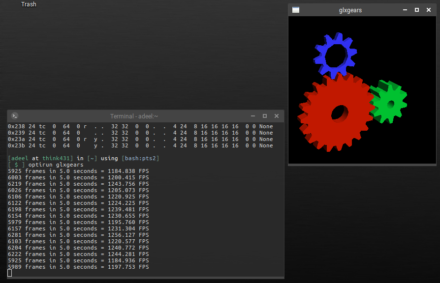
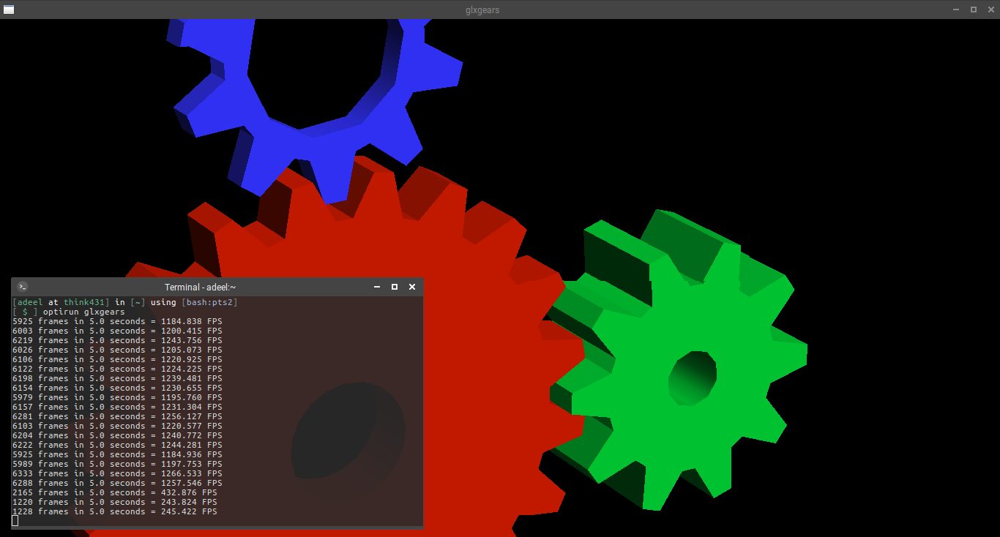

# Nvidia Bumblebee setup for Ubuntu 16.04 LTS and variants

Power ratings for graphics hardwares are increasing in correlation with processing capability. This factor limits the graphics processing cap on mobile devices. Advent of switchable graphics brought some interesting use cases to mobile computing platforms. For the first time in history, it gave laptop users a choice to configure their devices for a power optimized profile or a performance optimized profile. Graphics hardware manufacturers like Nvidia and AMD developed these profile customization possible for proprietary platforms Microsoft Windows and Mac OSX. Whereas open-source platforms (BSD, GNU/Linux etc.) were not officially addressed. It wasn't until the efforts of open-source projects like [Bumblebee](https://github.com/Bumblebee-Project/Bumblebee "Bumblebee Project's GitHub") and [Nvidia-Xrun](https://github.com/Witko/nvidia-xrun "Nvidia-Xrun's GitHub") that the *NIX users got to tweak their laptops for benefits of switchable graphics hardwares. Despite the amount of effort put in these projects, installation and configuration of these softwares via upstream repositories of different GNU/Linux distros is fragmented. Due to various factors (not an intended topic of this document), user-base for *NIX platforms has seen a dramatic rise in recent years. Also, gaming on GNU/Linux is on the rise. Not all users of *NIX platforms are power users and configuration for switchable graphics with upstream repos requires a certain level of knowledge and skill in Linux file system. Hence, one has to extensively search for the work-arounds proposed in online forums and blogs.

This document is the collection of all the tutorials and work-arounds proposed online to setup Bumblebee on GNU/Linux and it's tested on Ubuntu 16.04 with latest Nivida driver.

## Installation procedure

Following steps assume a fresh install of any flavor of Ubuntu (preferably 16.04 LTS) but it should work for newer versions as well.

### 1. Add repositories
   The latest Nvidia driver doesn't work with Bumblebee stable branch, therefore we need to add the testing branch and the proprietary driver ppa to system repos:
   ```bash
   sudo add-apt-repository ppa:graphics-drivers/ppa
   sudo add-apt-repository ppa:bumblebee/testing
   ```
### 2. Update package lists
   Make sure to pull latest package lists from upstream repos:
   ```bash
   sudo apt-get update
   ```
### 3. Remove default nouveau driver
  Completely remove the default driver:
  ```bash
  sudo apt-get remove xserver-xorg-video-nouveau
  ```
### 4. Install bumblebee, primus and Nvidia driver
  Notice that our command includes everything in order. Installing bumblebee-nvidia will install the old 304.x drivers by default. Specifying latest driver in the same apt-get line will explicitly tell it we want the new driver (nvidia-384 at the time of writing) as a substitute:
  ```bash
  sudo apt-get install bumblebee-nvidia nvidia-384
  ```
### 5. Blacklist Nvidia driver
  Do not reboot until you have done this. Rebooting now will result in a black-screen and you'll have to enter through recovery mode to blacklist them. In fact, don't reboot unless it explicitly says to. Add following lines to ```/etc/modprobe.d/bumblebee.conf```:
  ```
  blacklist nvidia-384
  blacklist nvidia-384-updates
  blacklist nvidia-experimental-384
  ```
  you can also add following to the end of the file:
  ```
  # Workaround to make sure nvidia-uvm is removed as well
  remove nvidia rmmod nvidia-uvm nvidia
  ```
### 6. Update bumblebee config to point to 384.x drivers
  This appears to be a bug in upstream repo. By default bumblebee-nvidia installs a config file that points to ```nvidia-current```, but that directory is empty or doesn't exist. Instead, we're going to point ours to 384.x. Change the following fields to the following values in ```/etc/bumblebee/bumblebee.conf```:
  ```
  [bumblebeed]
  ...
  .
  .
  .
  # The Driver used by Bumblebee server. If this value is not set (or empty),
  # auto-detection is performed. The available drivers are nvidia and nouveau
  # (See also the driver-specific sections below)
  Driver=nvidia
  .
  .
  .
  ## Section with nvidia driver specific options, only parsed if Driver=nvidia
  [driver-nvidia]
  # Module name to load, defaults to Driver if empty or unset
  KernelDriver=nvidia-384
  PMMethod=auto
  # colon-separated path to the nvidia libraries
  LibraryPath=/usr/lib/nvidia-384:/usr/lib32/nvidia-384  
  # comma-separated path of the directory containing nvidia_drv.so and the
  # default Xorg modules path
  XorgModulePath=/usr/lib/nvidia-384/xorg,/usr/lib/xorg/modules
  XorgConfFile=/etc/bumblebee/xorg.conf.nvidia
  .
  .
  ...
  ```
### 7. Select Mesa as your GL provider
  Update your alternatives to point all GL providers to ```mesa```. By default, all of your GL will run on the Intel card, and this will run through ```mesa```. Only through optirun/primusrun will things be handled by the NVidia GL implementation:
  ```
  sudo update-alternatives --config i386-linux-gnu_gl_conf
  ```
  and set i386 ```gl``` provider to ```/usr/lib/i386-linux-gnu/mesa/ld.so.conf```.
  ```
  sudo update-alternatives --config x86_64-linux-gnu_egl_conf
  ```
  and set ```egl``` provider to ```/usr/lib/x86_64-linux-gnu/mesa-egl/ld.so.conf```.
  ```
  sudo update-alternatives --config x86_64-linux-gnu_gl_conf
  ```
  and set x86_64 ```gl``` provider to ```/usr/lib/x86_64-linux-gnu/mesa/ld.so.conf```.
### 8. Disable gpu-manager
  The ```ubuntu-drivers-common``` package installs this thing called ```gpu-manager```. It's started by ```/etc/init/gpu-manager.conf```, which is run by upstart. What it actually does is create a new ```/etc/X11/xorg.conf``` every time you boot/reboot your laptop. We must disable it, because the ```xorg.conf``` it creates will break our setup. For this add ```nogpumanager``` to ```GRUB_CMDLINE_LINUX``` parameter in your ```/etc/default/grub``` file:
  ```
  GRUB_CMDLINE_LINUX="nogpumanager"
  ```  
  Now update your grub menu:
  ```
  sudo update-grub
  ```
### 9. Re-build the bbswitch and nvidia modules
  Now that all of the ```LD``` paths are refreshed after a reboot, we can re-build the kernel modules for ```ldconfig``` to be able to find the newly installed drivers and libraries. Also, do not reboot again until this step is complete. Doing so will result in a black screen.
  ```
  sudo dpkg-reconfigure bbswitch-dkms
  sudo dpkg-reconfigure nvidia-384
  ```
### 10. Reboot
  Now you may and should reboot in order for new driver and config to take effect.
### 11. Moment of Truth
  Now is the time to test your installation, whether all the pain you took to reach this point is fruitful or...

  Run ```glxinfo``` to check OpenGL vendor string:
  ```
  optirun glxinfo
  ```
  depending on your hardware and driver version, you'll see something like following:
  ```
  OpenGL vendor string: NVIDIA Corporation
  OpenGL renderer string: GeForce GT 740M/PCIe/SSE2
  OpenGL core profile version string: 4.5.0 NVIDIA 384.111
  OpenGL core profile shading language version string: 4.50 NVIDIA
  ```
  run ```glxgears``` to test rendering through NVidia OpenGL driver:
  ```
  optirun glxgears
  ```
  observe frame rate output in terminal window for small screen

  

  and full screen has a clear difference.

  

  If you see anything like this on your screen, you are welcome!

  #### Note: Black Screen, Xorg not Starting
  If you get a black or flickering screen on the next reboot, then you might have a remanent ```xorg.conf``` file. Just drop into recovery mode from GRUB menu and remove it:
  ```
  sudo rm /etc/X11/xorg.conf
  ```
